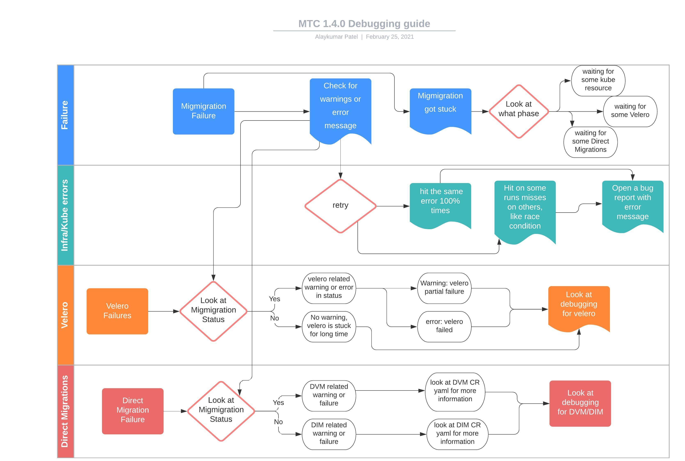
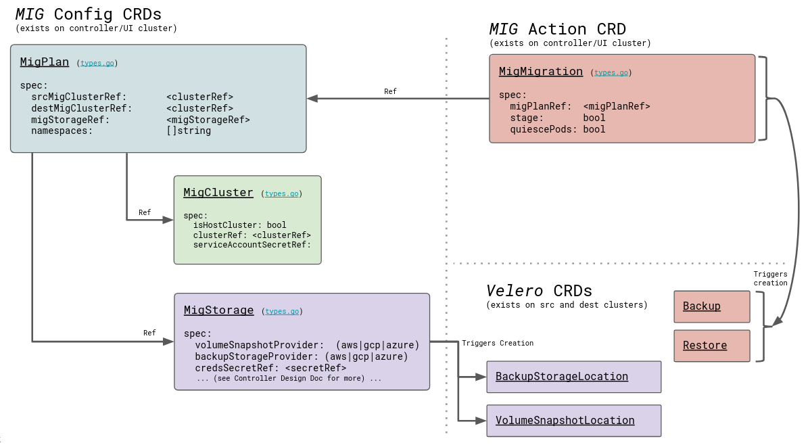
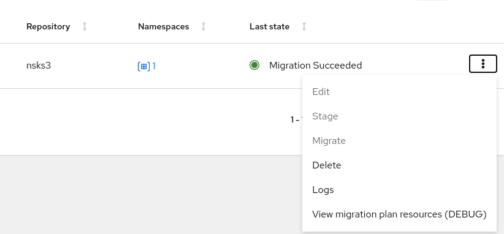

# Troubleshooting

This section describes common troubleshooting procedures.

Additional resources:
- [Upstream document](https://github.com/konveyor/enhancements/tree/master/enhancements/debug) for improving debug experience
- [MTC Debug flowchart](https://app.lucidchart.com/documents/view/d0907ce1-ccf1-4226-86eb-e5332f9d42a4/0_0) (in progress)

## Debugging MTC resources

### MTC custom resources

The following diagram describes the MTC debug flow.



The following diagram describes the MTC custom resources (CRs). Each object is a standard Kubernetes CR.

You can manage the MTC resources with the standard create, read, update, and delete operations using the `kubectl` and `oc` clients or directly, using the web interface.

<!-- TODO: Need to update diagram with MigAnalytic and MigHook -->



### Debugging MTC resources using the web console

You can view the resources of a migration plan in the MTC web console:

1. Click the **Options** menu next to a migration plan and select **View migration plan resources**.

   The migration plan resources are displayed as a tree.

2. Click the arrow of a **Backup** or **Restore** resource to view its pods.

3. Click the **Copy** button of a pod to copy the `oc get` command to your clipboard and paste the command on the command line.

4. Click **View Raw** to inspect a pod.

   The resource is displayed in JSON format.




Usually the objects that you should examine depend on the stage at which the
migration failed. The [MTC debug flowchart](https://app.lucidchart.com/documents/view/d0907ce1-ccf1-4226-86eb-e5332f9d42a4/0_0) provides information about which resources are relevant, depending on this failure stage.

**Stage migrations** have one `Backup` and one `Restore` resource.

**Final migrations** have two `Backup` and two `Restore` resources. The first `Backup` resource captures the original, unaltered state of the application and its Kubernetes objects. This `Backup` is the source of truth.

Then, the application is quiesced and a second `Backup` captures the storage-related resources (PVs, PVCs, data).

The first `Restore` restores these storage objects on the target cluster. The final `Restore` restores the original application `Backup` to the target cluster.

### Debugging migration resources from the command line

You can view the migration debug tree and query specific label selectors.

- To view all `migmigration` resources associated with the `test` migration plan:
  ```sh
  $ oc get migmigration -l 'migration.openshift.io/migplan-name=test'
  ```

  **Example output**
  ```sh
  NAME                                  READY  PLAN  STAGE  ITINERARY  PHASE
  09a8bf20-fdc5-11ea-a447-cb5249018d21         test  false  Final      Completed
  ```
  The columns display the associated plan name, itinerary step, and phase.

- To view all completed `migmigration` resources associated with the `test` migration plan:
  ```sh
  $ oc get migmigration -l 'migration.openshift.io/migplan-name=test' -o\
  go-template-file=./go-cli-templates/migmigration-completed-list.template
  ```

  **Example output**
  ```yaml
  Name:       51886050-6d52-11eb-98e7-b515603f1bc7
  Migplan:    test
  Result:     SucceededWithWarnings

  Name:       b4d045f0-6d58-11eb-98e7-b515603f1bc7
  Migplan:    test
  Result:     SucceededWithWarnings
  ```

  The `Result` parameter indicates a status of `Succeeded`, `SucceededWithWarnings`, or `Failed`.

- To view the warnings of all completed `migmigration` resources associated with the `test` migration plan:
  ```sh
  $ oc get migmigration -l 'migration.openshift.io/migplan-name=test' -o \
  go-template-file=go-cli-templates/migmigration-display-warning-list.template
  ```

  **Example output**
  ```yaml
  Name:       51886050-6d52-11eb-98e7-b515603f1bc7
  Migplan:    test
  Warning:    DirectVolumeMigrationFailed
      Message:        DirectVolumeMigration (dvm): openshift-migration/51886050-6d52-11eb-98e7-b515603f1bc7-z9zfj failed. See in dvm status.Errors
  errors:     <no value>

  Name:       b4d045f0-6d58-11eb-98e7-b515603f1bc7
  Migplan:    test
  Warning:    DirectVolumeMigrationFailed
      Message:        DirectVolumeMigration (dvm): openshift-migration/b4d045f0-6d58-11eb-98e7-b515603f1bc7-4c894 failed. See in dvm status.Errors
  errors:     <no value>
  ```

- To list all `Backup` resources:
  ```sh
  $ oc get backup -n openshift-migration
  ```

  **Example output**
  ```sh
  NAME                                   AGE
  88435fe0-c9f8-11e9-85e6-5d593ce65e10   6m42s
  ```

  You can use the same command to view `Restore` resources.

- To inspect a `Backup` resource:
  ```sh
  $ oc describe backup 88435fe0-c9f8-11e9-85e6-5d593ce65e10 -n openshift-migration
  ```

- To list failed migrations caused by direct volume migration failures:
  ```sh
  $ oc get dvm -l migmigration=<uid>
  ```

  **Example Output**
  ```sh
  NAME                                         AGE
  b4d045f0-6d58-11eb-98e7-b515603f1bc7-4c894   5d21h
  ```

- To list the direct volume migration failures and their causes:
  ```sh
  $ oc get dvm -l migmigration=<uid> \
  -o go-template-file=go-cli-templates/dvm-display-failure-list.template
  ```

  **Example Output**
  ```yaml
  Name:       b4d045f0-6d58-11eb-98e7-b515603f1bc7-4c894

      State:  Failed
      Phase:  WaitForRsyncClientPodsCompleted
      Message:        The migration has failed.  See: Errors.

  errors:     [One or more pods are in error state]
  ```

See [Viewing migration custom resources](https://docs.openshift.com/container-platform/4.7/migration/migrating_3_4/troubleshooting-3-4.html#migration-viewing-migration-crs_migrating-3-4) for more information.

## Debugging `backup` and `restore` resources with the Velero CLI

You can debug `backup` and `restore` resources with the Velero command line interface (CLI). The Velero CLI is included in the `velero` pod.

Velero CLI examines lower-level information in the object storage associated with a `Backup` or `Restore` resource. This information can reveal why a resource was not restored or why a Velero operation failed.

### Velero CLI commands

#### Syntax

Velero CLI commands use the following syntax:

```sh
$ oc exec $(oc get pods -n openshift-migration -o name | grep velero) -- ./velero <resource> <command> <resource_id>
```
> You can specify `velero-<pod> -n openshift-migration` in place of `$(oc get pods -n openshift-migration -o name | grep velero)`.

For a full list of commands, run `velero --help`:
```sh
$ oc exec $(oc get pods -n openshift-migration -o name | grep velero) -- ./velero --help
```

#### Velero `describe` command

The `describe` command provides a summary of warnings and errors associated with a Velero resource:
```sh
velero <resource> describe <resource_id>
```
**Example**
```sh
$ oc exec $(oc get pods -n openshift-migration -o name | grep velero) -- ./velero backup describe 0e44ae00-5dc3-11eb-9ca8-df7e5254778b-2d8ql
```

#### Velero `logs` command

The `logs` command provides a lower level output of the logs associated with a Velero resource:
```sh
velero <resource> logs <resource_id>
```
**Example**
```sh
$ oc exec $(oc get pods -n openshift-migration -o name | grep velero) -- ./velero restore logs ccc7c2d0-6017-11eb-afab-85d0007f5a19-x4lbf
```

### Debugging a partial failure with the Velero `logs` command

You can debug a partial failure by using the Velero `logs` command to examine the `restore` logs. A partial failure occurs when Velero encounters an issue but the issue does not cause a migration to fail.

For example, if a custom resource (CR) cannot be restored because the custom resource definition (CRD) is missing or is a different version on the target cluster, Velero logs the issue and then processes the rest of the objects in the `Backup` resource.

> In the future, Velero error reporting will be improved. See [MIG-353: Enhance Velero error reporting so problems that cause partial failures (and even full failures) are more visible in structured way](https://issues.redhat.com/browse/MIG-353)

**Debug example**

The following example describes how to debug a partially failed `restore` caused by GVK incompatibility. The CRD version on the source cluster differs from the CRD version on the target cluster. See the [GVK incompatibility exercise](https://github.com/pranavgaikwad/mtc-breakfix/tree/master/03-Gvk) for details.

1. Obtain the `MigMigration` instance associated with the partial failure:
    ```sh
    oc get migmigration ccc7c2d0-6017-11eb-afab-85d0007f5a19 -o yaml
    ```

    **Example output**

    ```yml
    status:
      conditions:
      - category: Warn
        durable: true
        lastTransitionTime: "2021-01-26T20:48:40Z"
        message: 'Final Restore openshift-migration/ccc7c2d0-6017-11eb-afab-85d0007f5a19-x4lbf: partially failed on destination cluster'
        status: "True"
        type: VeleroFinalRestorePartiallyFailed
      - category: Advisory
        durable: true
        lastTransitionTime: "2021-01-26T20:48:42Z"
        message: The migration has completed with warnings, please look at `Warn` conditions.
        reason: Completed
        status: "True"
        type: SucceededWithWarnings
    ```
    [Full output](https://gist.github.com/jwmatthews/001ff42bf5e712ba2eab92df306ed34e)

2. Check the status of the `restore` resource by running the `describe` command:
    ```sh
    $ oc exec $(oc get pods -n openshift-migration -o name | grep velero) -n openshift-migration -- ./velero restore describe ccc7c2d0-6017-11eb-afab-85d0007f5a19-x4lbf
    ```

    **Example output**

    ```yml
    Phase:  PartiallyFailed (run 'velero restore logs ccc7c2d0-6017-11eb-afab-85d0007f5a19-x4lbf' for more information)

    Errors:
      Velero:     <none>
      Cluster:    <none>
      Namespaces:
        gvk-demo:  error restoring gvkdemoes.konveyor.openshift.io/gvk-demo/gvk-demo: the server could not find the requested resource
    ```
    [Full output](https://gist.github.com/9a3ec8f51e12b84f8bb995286223bdda)

3. Check the `restore` logs by running the `logs` command:
    ```sh
    $ oc exec $(oc get pods -n openshift-migration -o name | grep velero) -n openshift-migration -- ./velero restore logs ccc7c2d0-6017-11eb-afab-85d0007f5a19-x4lbf
    ```

    **Example output**

    ```yml
    time="2021-01-26T20:48:37Z" level=info msg="Attempting to restore GvkDemo: gvk-demo" logSource="pkg/restore/restore.go:1107" restore=openshift-migration/ccc7c2d0-6017-11eb-afab-85d0007f5a19-x4lbf
    time="2021-01-26T20:48:37Z" level=info msg="error restoring gvk-demo: the server could not find the requested resource" logSource="pkg/restore/restore.go:1170" restore=openshift-migration/ccc7c2d0-6017-11eb-afab-85d0007f5a19-x4lbf
    ```

    [Full output](https://gist.github.com/jwmatthews/7dc7ed9eb0c4d0611f30675074b9b7d7)

    The `restore` log error message, `the server could not find the requested resource`, indicates the cause of the partially failed migration.

## Error messages

### CA certificate error when logging in to the MTC console for the first time

The following error message might appear when you log in to the MTC console for the first time:

```
A certificate error has occurred, likely caused by using self-signed CA certificates in one of the clusters. Navigate to the following URL and accept the certificate:
`https://www.example.com:6443/.well-known/oauth-authorization-server`.

If an "Unauthorized" message appears after you have accepted the certificate, refresh the web page.

To fix this issue permanently, add the certificate to your web browser's trust store.
```

Possible causes are self-signed certificates or network access issues.

Self-signed CA certificates:

- You can navigate to the `oauth-authorization-server` URL and accept the certificate.
- You can add self-signed certificates for the API server, OAuth server, and routes to your web browser's trusted store.

Network access:

- You can inspect the elements of the MTC console with your browser's web inspector to view the network connections.
- MTC 1.3.1 and earlier: The MTC console performs OAuth authentication on the client side.

  The console requires uninterrupted network access to the API server and the OAuth server.

- MTC 1.3.2 and later: OAuth authentication is performed on the backend.

  The console requires uninterrupted network access to the Node.js server, which provides the JavaScript bundle and performs OAuth authentication, and the API server. See [BZ#1878824](https://bugzilla.redhat.com/show_bug.cgi?id=1878824).

### Connection time-out after accepting CA certificate

If you acce[t] a self-signed certificate and a blank page appears, followed by a `Connection has timed out` message, the likely cause is a web proxy blocking access to the OAuth server.

Configure the web proxy configuration to allow access to the `oauth-authorization-server` URL. See [BZ#1890675](https://bugzilla.redhat.com/show_bug.cgi?id=1890675).

## Using `must-gather`

You can use the `must-gather` tool to collect information for troubleshooting or for opening a customer support case on the [Red Hat Customer Portal](https://access.redhat.com/). The `openshift-migration-must-gather-rhel8` image collects migration-specific logs and Custom Resource data that are not collected by the default `must-gather` image.

Run the `must-gather` command on your cluster:
```sh
$ oc adm must-gather --image=openshift-migration-must-gather-rhel8:v1.3.0
```

The `must-gather` tool generates a local directory that contains the collected data.

## Direct volume migration fails to complete

For direct volume migrations, we create a few dependencies:
1. Transfer pod on the destination cluster in target namespace. This pod
 has rsync daemon container and stunnel container
2. Stunnel service on the destination cluster in target namespace, this
 creates the networking presence for the stunnel container in kubernetes
3. Stunnel route on the destination cluster in target namespace, this
 creates a route to be exposed on the internet
4. Stunnel pod on the source cluster in source namespace, this connects to
 the target stunnel container in transfer pod through stunnel route on the
  target namespace
5. Rsync client pods on the source cluster in source namespace, this runs
 the actual rsync command for moving the PVC data.


If direct volume migration fails to complete, it could be one of the following
buckets of errors:

1. Error in creating dependencies: If creating any of the above dependencies
 fails, it could lead to a failure. The error message will be present in
 DVM status and in the errors fields. Use the dvm failure list command to
 find this.

2. Stuck in waiting for dependencies to be healthy: It could be the case
 that the pods on either source or destination is not running or the route
  is not admitted. In both these cases, DVM is hang until the pod is
  running or route is admitted. When the pods are stuck in a non-healthy
  state, you will find a Warning in 10 mins of DVM being stuck here. Use
  the dvm command to see warning on the dvm status

3. Rsync exits with error: this happens when all the dependencies are met
 and healthy and the rysnc fail because of some reason. The dvm controller
  does not clean up the failed rsync client pods so the logs can be inspected.

#### Example of debugging with dependency pod in pending state:

A very likely cause of direct volume migration failing to complete is the
 Rsync transfer pods on the target cluster remain in a `Pending` state.

MTC migrates namespaces with all annotations in order to preserve security context constraints and scheduling requirements. During direct volume migration, MTC creates Rsync transfer pods on the target cluster in the namespaces that were migrated from the source cluster. If the target cluster does not have the same node labels as the source cluster, the Rsync transfer pods cannot be scheduled.

You can check the `migmigration` CR status:
```sh
$ oc describe migmigration 88435fe0-c9f8-11e9-85e6-5d593ce65e10 -n openshift-migration
```

The output displays the following `status` message:
```
Some or all transfer pods are not running for more than 10 mins on destination cluster
```

To resolve this issue, perform the following steps:

1. Obtain the value of the `openshift.io/node-selector` annotation of the migrated namespaces on the source cluster:
```sh
$ oc get namespace -o yaml
```
2. Add the `openshift.io/node-selector` annotation to each migrated namespace on the target cluster:
```yml
apiVersion: v1
kind: Namespace
metadata:
  annotations:
    openshift.io/node-selector: "region=east"
...
```
3. Re-run the migration plan.

## Previewing metrics on local Prometheus server

You can use `must-gather` to create a metrics data directory dump from the last day:

```sh
$ oc adm must-gather --image quay.io/konveyor/must-gather:latest -- /usr/bin/gather_metrics_dump
```

You can view the data with a [local Prometheus instance](https://github.com/konveyor/must-gather#preview-metrics-on-local-prometheus-server).

## Performance metrics

For information about the metrics recorded by the MTC controller, see the [`mig-operator` documentation](https://github.com/konveyor/mig-operator/blob/master/docs/usage/Metrics.md#accessing-mig-controller-prometheus-metrics).

This documentation includes [useful queries](https://github.com/konveyor/mig-operator/blob/master/docs/usage/Metrics.md#useful-queries) for performance monitoring.

## Cleaning up a failed migration

### Deleting resources

Ensure that stage pods are cleaned up. If a migration fails during stage or copy, the stage pods are retained to allow debugging. Before retrying a migration, you must delete the stage pods manually.

### Unquiescing an application

If your application was quiesced during migration, you should `unquiesce` it by scaling it back to its initial replica count.

This can be done manually by editing the deployment primitive (`Deployment`, `DeploymentConfig`, etc.) and setting the `spec.replicas` field back to its original, non-zero value:

```sh
$ oc edit deployment <deployment_name>
```

Alternatively, you can scale your deployment with the `oc scale` command:

```sh
$ oc scale deployment <deployment_name> --replicas=<desired_replicas>
```

### Labels for premigration settings

When a source application is quiesced during migration, MTC adds a label indicating the original replica count to the `deployment` resource:

```yaml
apiVersion: extensions/v1beta1
kind: Deployment
metadata:
  annotations:
    deployment.kubernetes.io/revision: "1"
    migration.openshift.io/preQuiesceReplicas: "1"
```

### Deleting the MTC Operator and resources

The following procedure removes the MTC Operator and cluster-scoped resources:

1. Delete the Migration Controller and its resources:

   ```sh
   $ oc delete migrationcontroller <resource_name>
   ```

   Wait for the MTC Operator to finish deleting the resources.

2. Uninstall the MTC Operator:

   - OpenShift 4: Uninstall the Operator in the [web console](https://docs.openshift.com/container-platform/4.6/operators/olm-deleting-operators-from-cluster.html) or by running the following command:

   ```sh
   $ oc delete ns openshift-migration
   ```

   - OpenShift 3: Uninstall the operator by deleting it:
     ```sh
     $ oc delete -f operator.yml
     ```

3. Delete the cluster-scoped resources:
   - Migration custom resource definition:
     ```sh
     $ oc delete $(oc get crds -o name | grep 'migration.openshift.io')
     ```
   - Velero custom resource definition:
     ```sh
     $ oc delete $(oc get crds -o name | grep 'velero')
     ```
   - Migration cluster role:
     ```sh
     $ oc delete $(oc get clusterroles -o name | grep 'migration.openshift.io')
     ```
   - Migration-operator cluster role:
     ```sh
     $ oc delete clusterrole migration-operator
     ```
   - Velero cluster role:
     ```sh
     $ oc delete $(oc get clusterroles -o name | grep 'velero')
     ```
   - Migration cluster role bindings:
     ```sh
     $ oc delete $(oc get clusterrolebindings -o name | grep 'migration.openshift.io')
     ```
   - Migration-operator cluster role bindings:
     ```sh
     $ oc delete clusterrolebindings migration-operator
     ```   
   - Velero cluster role bindings:
     ```sh
     $ oc delete $(oc get clusterrolebindings -o name | grep 'velero')
     ```
